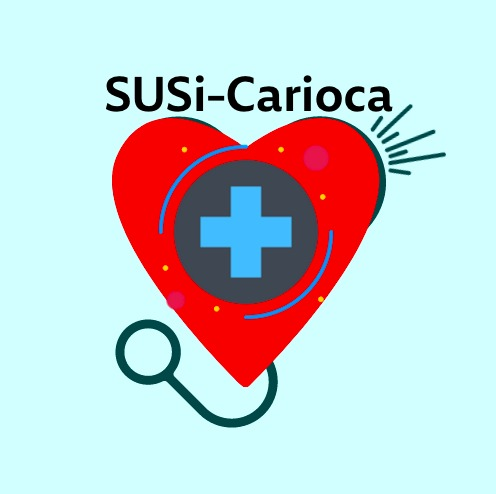

# **Chatbot SUSi-Carioca**: 
*Repositório do código do Controlador do Chatbot SUSi-Carioca para o Trabalho de Conclusão de Curso, com o tema:* 

## *"SUSi-Carioca: Chatbot de pós-atendimento das consultas no SUS utilizando práticas de Linguagem Simples"*

# **SUSi-Carioca:**

Os pacientes da rede de saúde pública brasileira possuem dificuldades na obtenção de informação antes, durante e pós-consultas médicas. Mesmo quando recebem informações, a dificuldade em entendê-las impede o acesso destes pacientes aos serviços disponíveis. Este trabalho tem como objetivo analisar este problema na visão do cidadão que é usuário dos sistemas de saúde da rede pública de saúde e propor uma aplicação que possa reduzir as dificuldades encontradas por este público. Considerando as práticas da Linguagem Simples, é desenvolvida uma integração do Whatsapp com a base de dados de usuários da rede do Sistema Único de Saúde, SUS. Essa integração funciona como canal de atendimento que responde às dúvidas dos pacientes sobre consultas, exames e medicamentos.

   

### Projeto Final apresentado ao Instituto de Matemática e Estatística da Universidade do Estado do Rio de Janeiro, para obtenção do grau de bacharel em Ciência da Computação.

## Contatos:

*Nilson Junio Souza de Silva:*

   

*Thalles Cotta Fontainha:*

   

